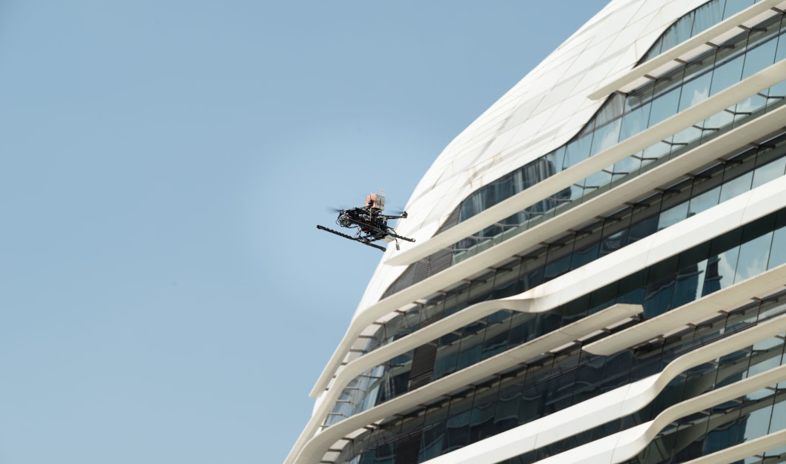
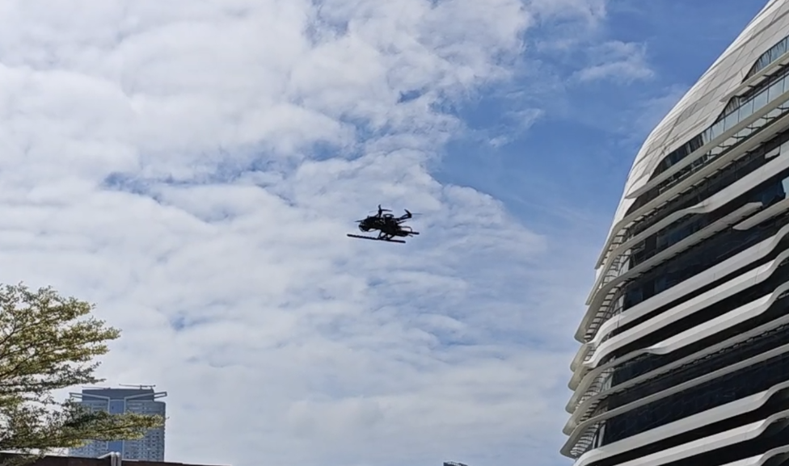
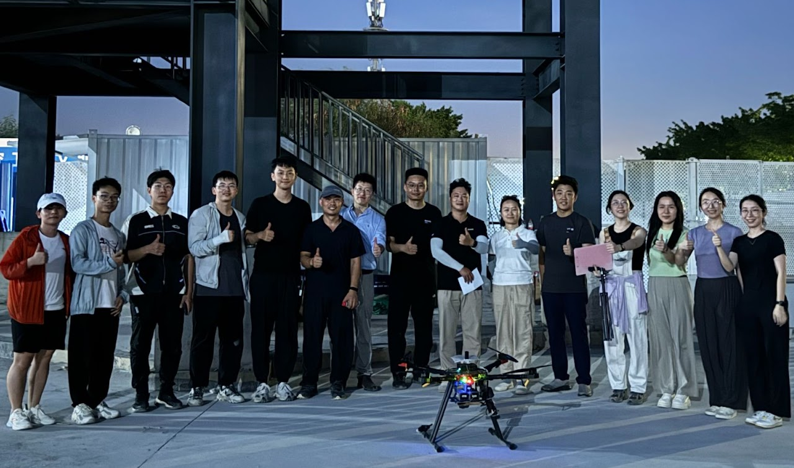

With the popularity of online shopping in the recent decade, offline shipping has been in a state of fast development. In general, parcel shipping is divided into long-range and short-range. Long-range shipping usually refers to the process of transporting parcels between depots; while short-range usually refers to the process of transporting parcels between customers and a depot or warehouse. For the latter, the traditional method uses a van, which departs from the depot with a set of parcels and visits each customer one by one. This method is costly and non-environmental friendly. A recent concept of drone delivery has come to the front and it has been tested by some large logistics companies. Using drones for delivery may save lots of money for logistics companies if well managed. 

